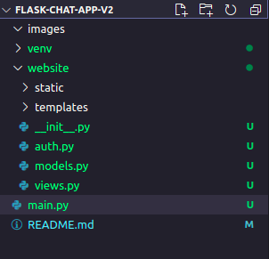

# flask-chat-app-v2
This is a Chat app using **Flask** and **SocketIO**.

<br>

# Part 1 : Setting up
## Creating the basic app structure

First create the folders and the files shown below. 



It is the basic structure. Here the ``__init__.py`` converts the website folder into a python package .So we will be able to import this website folder as a module.

<br>

## Activating the virtual environment

Creating a virtual environment

    python3 -m venv venv

Running the virtual environment

    source venv/bin/activate

Installing python packages with pip

    (venv) $ pip install flask

When you execute this command, pip will not only install Flask, but also all of its dependencies. You can check what packages are installed in the virtual environment at any time using the pip freeze command:

    (venv) $ pip freeze
    click==7.1.2
    Flask==1.1.2
    itsdangerous==1.1.0
    Jinja2==2.11.3
    MarkupSafe==1.1.1
    Werkzeug==1.0.1


For login

    (venv) $ pip install flask-login

For database

    (venv) $ pip install flask-sqlalchemy

<br>

# Part 2

1. Now first build the ``base.html`` template.
2. After that just extend the base in
    - home.html
    - login.html
    - signup.html
    - chat.html

3. Now create forms in signup and login pages using bootstrap forms.

<br>

# Part 3
## Creating database

<br>

## Database Model:
importing SQLAlchemy

    from flask_sqlalchemy import SQLAlchemy

Creating the object

    db = SQLAlchemy()
    DB_NAME = "database.db"

Importing the db object in models.py and making database models.

```python
from . import db
from flask_login import UserMixin
from sqlalchemy.sql import func


# The User will inherit database model and UserMixin . The UserMixin is for authentication
# purpose
class User(db.Model , UserMixin):
    id = db.Column(db.Integer , primary_key = True)
    email = db.Column(db.String(150) , unique = True)
    password = db.Column(db.String(150))
    firstname = db.Column(db.String(150))
    lastname = db.Column(db.String(150))
    
    #sudo coloumns in Room , Participant , Message
    rooms = db.relationship('Room',backref=db.backref('user-id'))
    participants_userid = db.relationship('Participant',backref=db.backref('user-id'))
    message_userid = db.relationship('Message' , backref = db.backref('user-id'))

    rooms = db.relationship('Room',backref=db.backref('user-id'))

    


class Room(db.Model):
    id = db.Column(db.Integer , primary_key = True)
    roomid = db.Column(db.String(150) , unique = True)
    userid = db.Column(db.String(150),db.ForeignKey('user.id'))

    #sudo coloumns in Participant , Message
    participants_roomid = db.relationship('Participant',backref=db.backref('room-id'))
    message_userid = db.relationship('Message' , backref = db.backref('user-id'))


class Participant(db.Model):
    id = db.Column(db.Integer , primary_key = True)
    userid = db.Column(db.String(150),db.ForeignKey('user.id'))
    roomid = db.Column(db.String(150),db.ForeignKey('room.roomid'))

class Message(db.Model):
    id = db.Column(db.Integer , primary_key = True)
    userid = db.Column(db.String(150),db.ForeignKey('user.id'))
    roomid = db.Column(db.String(150),db.ForeignKey('room.roomid'))
    date = db.Column(db.DateTime(timezone=True), default = func.now())
    message = db.Column(db.String(10000))
    


```

<br>

Now creating the database

```python
# initializing the data base
    app.config['SQLALCHEMY_DATABASE_URI'] = f'sqlite:///{DB_NAME}'

    # for debugging sql
    app.config['SQLALCHEMY_ECHO'] = True
    db.init_app(app)

    # for creating database
    from .models import User , Room , Participant , Message
    create_database(app)
```

<br>

The create database function

```python
def create_database(app):
    # if the database does not exist then we will create it
    if not path.exists('website/'+DB_NAME):
        db.create_all(app = create_app())
        print('Database created')

```
<br>

## Note
SQLAlchemy 1.4.0 is breaking for some reason but
    
    pip install SQLAlchemy==1.3.23

or

    pip install 'SQLAlchemy<1.4.0'

worked


# Part 4
## Installing flask-admin for debugging the data base

Installing wheel package

    pip install wheel

Installing flask admin

    pip install flask-admin

Importing the package

```python
# for admin page
from flask_admin import Admin
from flask_admin.contrib.sqla import ModelView
```

We could have used ModelView directly.But we didnt because by inheriiting the ModelView in ChildView we can customize it.

```python
# for admin page
    admin = Admin(app)
    class ChildView(ModelView):
        column_display_pk = True # optional, but I like to see the IDs in the list
        column_hide_backrefs = False
    
    admin.add_view(ChildView(User, db.session))
    admin.add_view(ChildView(Note, db.session))
```

<br>

# Part 5

### LoginManager
For manging the user login
```python
# for mannaging the user login
    # if the user is not logged in then he/she will be redirected to auth.login
    login_manager = LoginManager()
    login_manager.login_view = 'views.home'
    login_manager.init_app(app)

    @login_manager.user_loader 
    def load_user(id):
        return User.query.get(int(id))
```


<br>

# Part 6


