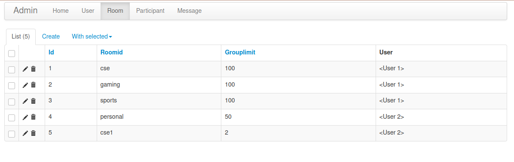

# flask-chat-app-v2
This is a Chat app using **Flask** and **SocketIO**.
Below are some documentation while making this app.The Doc just conatains key points during the dev.

Moreover I have not finished the project fully during to time constraint.

What I have not completed
- deleting data from database
- email verification
- etc


## But its still very usable and plays as a demo of how socketio could be used in flask.

## Here are some screenshots

### DESKTOP VIEW


### MOBILE VIEWS


<br>

# Part 1 : Setting up
## Creating the basic app structure

First create the folders and the files shown below. 


It is the basic structure. Here the ``__init__.py`` converts the website folder into a python package .So we will be able to import this website folder as a module.

<br>

## Activating the virtual environment

Creating a virtual environment

    python3 -m venv venv

Running the virtual environment

    source venv/bin/activate

Installing python packages with pip

    (venv) $ pip install flask

When you execute this command, pip will not only install Flask, but also all of its dependencies. You can check what packages are installed in the virtual environment at any time using the pip freeze command:

    (venv) $ pip freeze
    click==7.1.2
    Flask==1.1.2
    itsdangerous==1.1.0
    Jinja2==2.11.3
    MarkupSafe==1.1.1
    Werkzeug==1.0.1


For login

    (venv) $ pip install flask-login

For database

    (venv) $ pip install flask-sqlalchemy

<br>

# Part 2

1. Now first build the ``base.html`` template.
2. After that just extend the base in
    - home.html
    - login.html
    - signup.html
    - chat.html

3. Now create forms in signup and login pages using bootstrap forms.

<br>

# Part 3


## Database Schema


This is a simple image of the database structure we will be needing.

<br>
<br>

## Database Model:
importing SQLAlchemy

    from flask_sqlalchemy import SQLAlchemy

Creating the object

    db = SQLAlchemy()
    DB_NAME = "database.db"

Importing the db object in models.py and making database models.

```python
from . import db
from flask_login import UserMixin
from sqlalchemy.sql import func


# The User will inherit database model and UserMixin . The UserMixin is for authentication purpose
class User(db.Model , UserMixin):
    id = db.Column(db.Integer , primary_key = True)
    email = db.Column(db.String(150) , unique = True)
    password = db.Column(db.String(150))
    firstname = db.Column(db.String(150))
    lastname = db.Column(db.String(150))
    

    # pseudo columns
    rooms = db.relationship("Room" , backref = "user")
    participants = db.relationship("Participant" , backref = "user")
    messages = db.relationship("Message" , backref = "user")
    
    # def __repr__(self):
    #     return f"User('{self.username}','{self.userEmail}','{self.image_file}')"


class Room(db.Model):
    id = db.Column(db.Integer , primary_key = True)
    roomid = db.Column(db.String(150) , unique = True)
    userid = db.Column(db.String(150),db.ForeignKey('user.id'))
    grouplimit = db.Column(db.String(150) , default = 2)

    # pseudo columns
    participants = db.relationship("Participant" , backref = "room")
    messages = db.relationship("Message" , backref = "room")


class Participant(db.Model):
    id = db.Column(db.Integer , primary_key = True)
    userid = db.Column(db.String(150),db.ForeignKey('user.id'))
    roomid = db.Column(db.String(150),db.ForeignKey('room.id'))
    # i cant relate it with Rooms roomid
    roomname = db.Column(db.String(150))
    

class Message(db.Model):
    id = db.Column(db.Integer , primary_key = True)
    date = db.Column(db.DateTime(timezone=True), default = func.now())
    message = db.Column(db.String(10000))
    username = db.Column(db.String(100))
    userid = db.Column(db.String(150),db.ForeignKey('user.id'))
    roomid = db.Column(db.String(150),db.ForeignKey('room.id'))
    
```

<br>

Now creating the database

```python
# initializing the data base
    app.config['SQLALCHEMY_DATABASE_URI'] = f'sqlite:///{DB_NAME}'

    # for debugging sql
    app.config['SQLALCHEMY_ECHO'] = True
    db.init_app(app)

    # for creating database
    from .models import User , Room , Participant , Message
    create_database(app)
```

<br>

The create database function

```python
def create_database(app):
    # if the database does not exist then we will create it
    if not path.exists('website/'+DB_NAME):
        db.create_all(app = create_app())
        print('Database created')

```

## How the database looks in admin panel:

The User table:


The Room table:


The Participant table:


The Message table:


<br>

## Note
SQLAlchemy 1.4.0 is breaking for some reason but
    
    pip install SQLAlchemy==1.3.23

or

    pip install 'SQLAlchemy<1.4.0'

worked


# Part 4
## Installing flask-admin for debugging the data base

Installing wheel package

    pip install wheel

Installing flask admin

    pip install flask-admin

Importing the package

```python
# for admin page
from flask_admin import Admin
from flask_admin.contrib.sqla import ModelView
```

We could have used ModelView directly.But we didnt because by inheriiting the ModelView in ChildView we can customize it.

```python
# for admin page
    admin = Admin(app)
    class ChildView(ModelView):
        column_display_pk = True # optional, but I like to see the IDs in the list
        column_hide_backrefs = False # we want to see the backref too
    
    admin.add_view(ChildView(User, db.session))
    admin.add_view(ChildView(Note, db.session))
```

<br>

# Part 5

### LoginManager
For manging the user login
```python
# for mannaging the user login
    # if the user is not logged in then he/she will be redirected to auth.login
    login_manager = LoginManager()
    login_manager.login_view = 'views.home'
    login_manager.init_app(app)

    @login_manager.user_loader 
    def load_user(id):
        return User.query.get(int(id))
```


<br>

# Part 6

## Socketio:

Since I have to initialize the whole app inside the socketio wrapper using

    app = create_app()
    socketio = SocketIO(app)

I have written the whole socketio connection code inside the main.py file


## install the flask socketio using pip
    
    pip install flask-socketio

## **Note**

<br>

| JavaScript Socket.IO version | Socket.IO protocol revision | Engine.IO protocol revision | Flask-SocketIO version | python-socketio version | python-engineio version |
|------------------------------|-----------------------------|-----------------------------|------------------------|-------------------------|-------------------------|
| 0.9.x                        | 1,2                         | 1,2                         | Not supported          | Not supported           | Not supported           |
| 1.x and 2.x                  | 3,4                         | 3                           | 4.x                    | 4.x                     | 3.x                     |
| 3.x                          | 5                           | 4                           | 5.x                    | 5.x                     | 4.x                     |

<br>

I have installed Flask-SocketIO version 5, so you need version 3 of the JavaScript client, from the above table

I will use this CDN URL  version 3.0.5: https://cdnjs.cloudflare.com/ajax/libs/socket.io/3.0.5/socket.io.min.js 

    <script src="https://cdnjs.cloudflare.com/ajax/libs/socket.io/3.0.5/socket.io.min.js"></script>


<br>

# Part 7

## Basic Connection of how the socket works


## Deploying the app in HEROKU

<br>
Creating a Prockfile
    
    touch Procfile

<br>
Now we will be using gunicorn webserver.Since we need websocket support for socketio.
<br>
For this we have to add the below line inside the Procfile.

    web: gunicorn -k geventwebsocket.gunicorn.workers.GeventWebSocketWorker -w 1 main:app

## OR (for me it didn't work .So I used **eventlet**)

    web: gunicorn main:app --log-file=-
    web: gunicorn --worker-class eventlet -w 1 main:app

<br>


Since the app will be using green unicorn server and app socket so we need to install gunicorn

    pip install gunicorn

<br>

next we install gevent web socket
    
    pip install gevent-websocket

<br>

Now add a text file named **requirements.txt**

    touch requirements.txt

Now copy the packages and dependencies in the requirements.txt file

    pip freeze > requirements.txt

>Now just add , commit and push it in the **github** repo.

<br>


## requirements.txt
```cmd
bidict==0.21.2
click==7.1.2
dnspython==1.16.0
eventlet==0.30.2
Flask==1.1.2
Flask-Admin==1.5.7
Flask-Login==0.5.0
Flask-SocketIO==5.0.1
Flask-SQLAlchemy==2.4.4
gevent==21.1.2
gevent-websocket==0.10.1
greenlet==1.0.0
gunicorn==20.1.0
itsdangerous==1.1.0
Jinja2==2.11.3
MarkupSafe==1.1.1
python-engineio==4.0.1
python-socketio==5.1.0
six==1.15.0
SQLAlchemy==1.3.23
Werkzeug==1.0.1
WTForms==2.3.3
zope.event==4.5.0
zope.interface==5.3.0
```

<br>

# Part 4
## Using HEROKU with gui(easy)

- Select an app name
- Select the deployment method as github
- Connect your github repo account
- enable the automatic deploy and deploy the app.

Heroku Log:
```cmd


2021-03-03T18:20:03.181821+00:00 app[api]: Release v25 created by user naheed28ray@gmail.com

2021-03-03T18:20:03.181821+00:00 app[api]: Deploy d2fe39d5 by user naheed28ray@gmail.com

2021-03-03T18:20:03.378521+00:00 heroku[web.1]: State changed from down to starting

2021-03-03T18:20:10.209218+00:00 heroku[web.1]: Starting process with command `gunicorn --worker-class eventlet -w 1 app:app`

2021-03-03T18:20:13.000000+00:00 app[api]: Build succeeded

2021-03-03T18:20:15.040638+00:00 app[web.1]: [2021-03-03 18:20:15 +0000] [4] [INFO] Starting gunicorn 20.0.4

2021-03-03T18:20:15.041637+00:00 app[web.1]: [2021-03-03 18:20:15 +0000] [4] [INFO] Listening at: http://0.0.0.0:22462 (4)

2021-03-03T18:20:15.047630+00:00 app[web.1]: [2021-03-03 18:20:15 +0000] [4] [INFO] Using worker: eventlet

2021-03-03T18:20:15.063497+00:00 app[web.1]: [2021-03-03 18:20:15 +0000] [9] [INFO] Booting worker with pid: 9

2021-03-03T18:20:15.516994+00:00 heroku[web.1]: State changed from starting to up

```


## Well done.😎😎👌👊
<br>
<br>

Reference
- https://flask-socketio.readthedocs.io/en/latest/
- [Polling vs WebSockets vs Socket.IO](https://youtu.be/sUEq35F-ELY)
- [Basic Chat Application | Chat Application using Flask, Socket.IO & mongoDB (Part-1)](https://youtu.be/uJC8A_7VZOA)
- ["Deploying Flask App to Heroku - Chat App Part13"](https://youtu.be/FWU_tJqr1Po)


# The End


